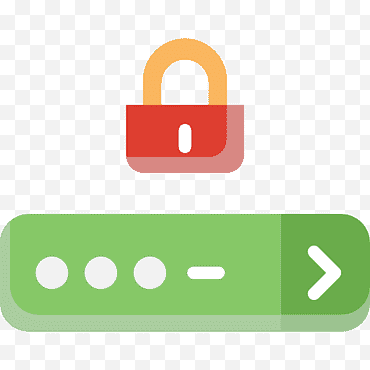

 

  
  <h3 align="center">Passcast</h3>

Creating custom password lists that work can be quite a process.
The goal for this project is to make an all in one solution for custom/personalised password list generation.
The inspiration is a combination of [CUPP](https://null-byte.wonderhowto.com/how-to/tutorial-password-profiling-with-cupp-0165951/) and [Mentalist](https://github.com/sc0tfree/mentalist) in one smooth workflow.
